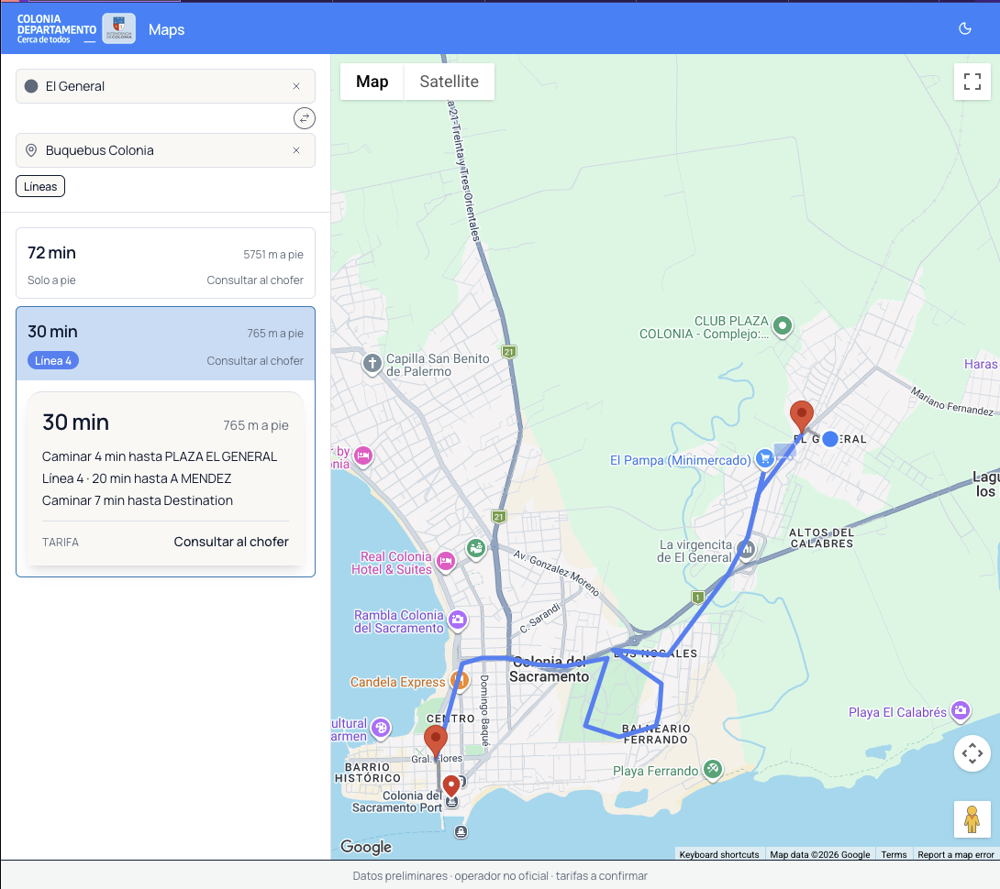
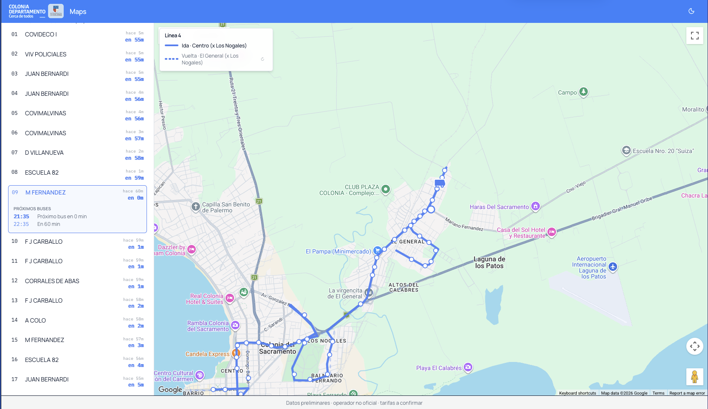
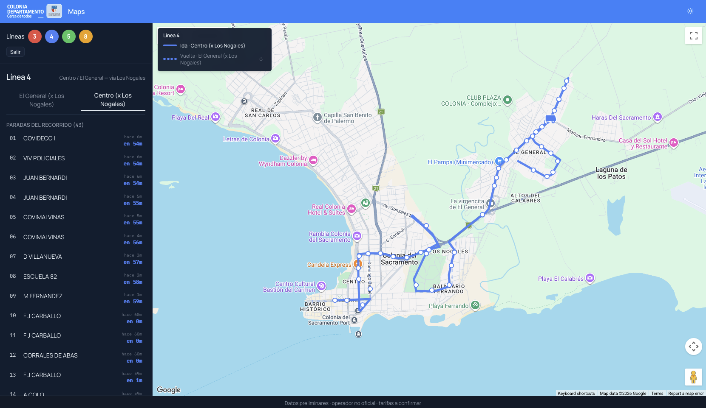

# colonia-gtfs

**Español** · [English](README.en.md)

App web mobile-first para que turistas vean cómo llegar en colectivo entre dos puntos de Colonia del Sacramento, Uruguay. Mimetiza la experiencia de Google Maps Transit, calcula los viajes localmente con OpenTripPlanner y combina horarios oficiales con la posición real de los buses.

> **Estado:** v0 en diseño. Primer PRD disponible en [`docs/prd/mvp-v0.md`](docs/prd/mvp-v0.md). Implementación pendiente, organizada como una serie de cambios OpenSpec.

## Cobertura v0

Operador **Sol Antigua** (urbano Colonia del Sacramento), líneas 3, 4, 5 y 8. Otros operadores (ABC Coop, suburbano) y geografía extendida son v0.1+.

## Capturas

### Modo Origen → Destino

Plan calculado localmente por OTP. Origen (círculo cobalto) y destino (pin rojo) usan los mismos iconos Lucide que los inputs del sidebar; el detalle del itinerario seleccionado se expande inline bajo su tarjeta.

### Modo línea

Recorrido completo de la línea con todas sus paradas. El bus se actualiza cada 15 s desde el AVL del operador a través de nuestro bridge GTFS-RT.

### Detalle de parada

Al tocar una parada (en el sidebar o en el mapa) se resalta la fila y aparece la lista "PRÓXIMOS BUSES" con la hora y los minutos restantes.

## Stack conceptual

Tres services en Docker Compose: `viewer` (Next.js — UI + API routes, único container público) → `otp` (motor de routing OTP 2) + `bridge` (NestJS, AVL → GTFS-RT). Detalles en el [PRD §6](docs/prd/mvp-v0.md#6-arquitectura-conceptual).

## Documentación

El trabajo arranca desde un PRD, sigue con un spec en OpenSpec y termina en código.

- **[`docs/prd/`](docs/prd/)** — PRDs (Product Requirements Documents): el *qué* y el *por qué*.
- **[`openspec/`](openspec/)** — Specs y propuestas de cambio: el *cómo*.
- **[`data/`](data/)** — Feed GTFS Schedule estático (Sol Antigua urbano Colonia). Ver [`data/README.md`](data/README.md) para el contrato de mantenimiento y el flow de update.
- **[`deployment/`](deployment/)** — Stack runtime (Docker Compose): OpenTripPlanner 2 sobre el feed estático. Ver [`deployment/README.md`](deployment/README.md) para boot, healthz y troubleshooting.
- **[`bridge/`](bridge/)** — Service NestJS que poolea el AVL del operador y emite GTFS-Realtime para OTP. Ver [`bridge/README.md`](bridge/README.md) para el contrato de endpoints, healthz, comportamiento ante AVL caído, y manejo del secret `ORIGIN_AVL`.
- **[`viewer/`](viewer/)** — App Next.js (App Router) que combina la UI mobile-first y las API routes (BFF). Único container con puerto público. Ver [`viewer/README.md`](viewer/README.md) para boot, dev mode, endpoints, chrome persistente, i18n y CORS.
- **[`docs/release-process.md`](docs/release-process.md)** — Cómo cortar un release del feed (rama `release/X.Y.Z` → merge → tag `vX.Y.Z` → workflow publica GitHub Release con `gtfs.zip`).

## Desarrollo

El toolchain Python (scripts de build/validate/refresh, tests, lints, helpers de CI) vive bajo [`tooling/`](tooling/). Setup, comandos y dependencias en [`tooling/README.md`](tooling/README.md).

## Licencias

Este repo tiene **doble licencia**:

- **Código** — [MIT](LICENSE). Aplica a todo lo que no esté bajo `data/`: viewer, bridge, tooling, deployment, openspec, docs.
- **Datos GTFS** — [CC BY 4.0](data/LICENSE). Aplica al contenido de `data/` (archivos `.txt`, `shapes.txt`, el recorte `colonia.osm.pbf`) y al `gtfs.zip` publicado en GitHub Releases. Si reutilizás el feed, atribuí a `colonia-gtfs` con link al repo.
